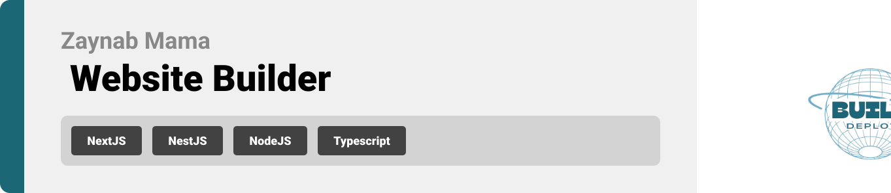
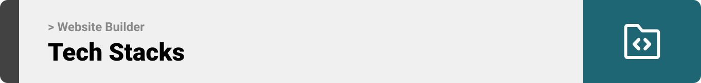
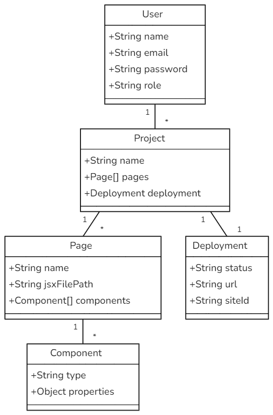
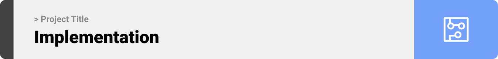
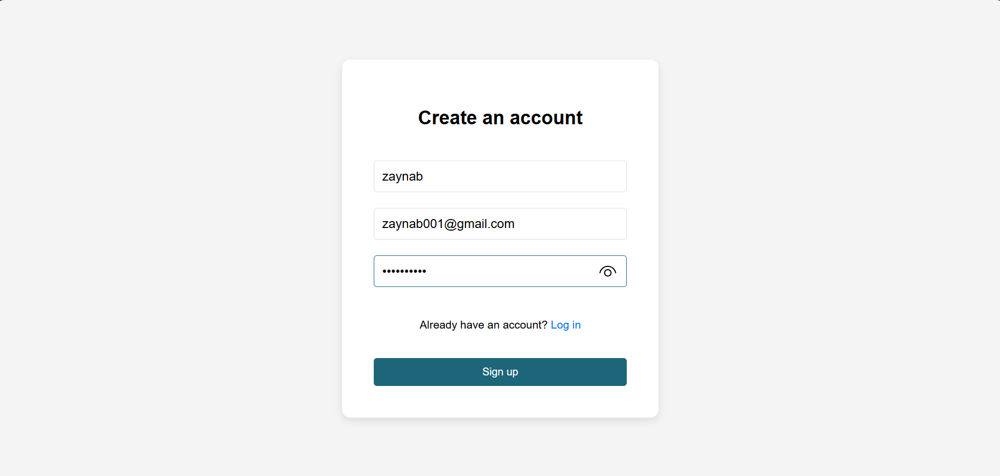
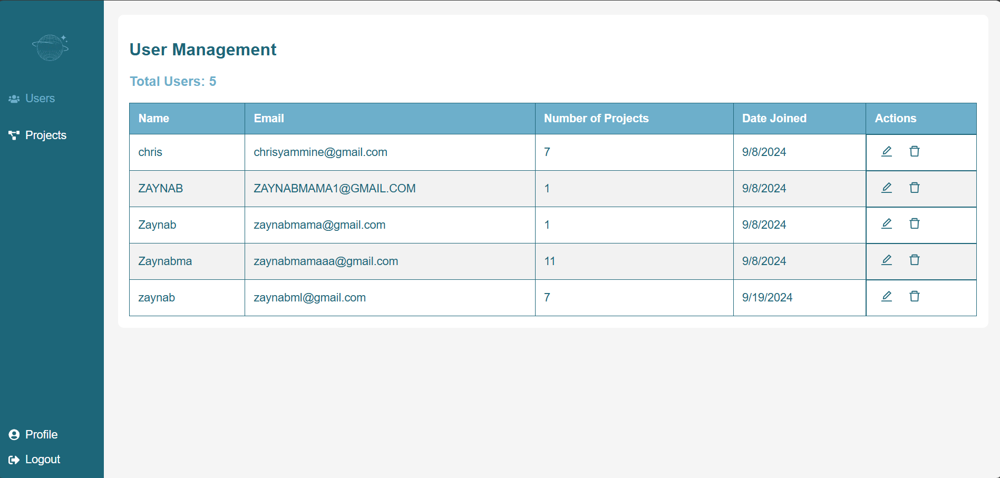
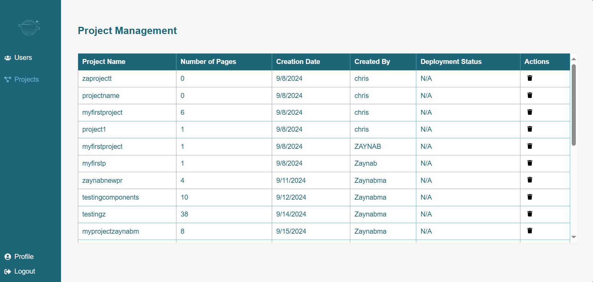
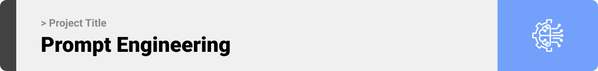

<br><br>

<!-- project philosophy -->


> A web-based platform that allows users to create, customize, and deploy websites effortlessly by selecting pre-designed components and deploying the site with a single click on netlify. The goal is to simplify website creation and make it accessible for everyone, regardless of technical expertise.


### User Stories
- As a user, I want to choose from various website components, so I can build a site that meets my needs.
- As a user, I want to preview my website before deploying it, so I can ensure it looks as expected.
- As a user, I want to deploy my website with a single click, so I can publish it quickly and easily.
<br><br>
<!-- Tech stack -->


###  Website Builder is built using the following technologies:

- This project uses the Next.js and NestJS frameworks. Next.js is a powerful React-based framework that enables optimized web application development with server-side rendering and static site generation. NestJS is used for building scalable server-side applications with a structured architecture using Node.js.

- The project utilizes MongoDB as the database management system, which provides flexible schema design and high scalability for data storage and retrieval.

- To provide real-time customization, the app features a Customization Panel, allowing users to modify component properties with instant visual feedback—no manual saving required.

- For deployment, the project can be integrated with the Netlify API using an API key, enabling automated deployments and continuous integration directly from the repository.


<br><br>
<!-- UI UX -->


> We designed Website Builder using wireframes and mockups, iterating on the design until we reached the ideal layout for easy navigation and a seamless user experience.

- Project Figma design [figma](https://www.figma.com/file/LsuOx5Wnh5YTGSEtrgvz4l/Purrfect-Pals?type=design&node-id=257%3A79&mode=design&t=adzbABt5hbb91ucZ-1)


### Mockups
| LogIn Screen | About Screen |
| ---| ---|
|  | .png) |

<br><br>

<!-- Database Design -->


###  Architecting Data Excellence: Innovative Database Design Strategies:




<br><br>


<!-- Implementation -->



### Admin Screens (Web)
| Login screen  | Register screen |
| ---| ---|
| .png) |  |
| UserManagement screen  | ProjectManagement Screen |
|  |  |

<br><br>
### User Screens (Web)
| Login screen  | Register screen |
| ---| ---|
|  |  |
| Home screen  | Menu Screen |
|  |  |

<br><br>


<!-- Prompt Engineering -->


###  Mastering AI Interaction: Unveiling the Power of Prompt Engineering:

- This project uses advanced prompt engineering techniques to optimize the interaction with natural language processing models. By skillfully crafting input instructions, we tailor the behavior of the models to achieve precise and efficient language understanding and generation for various tasks and preferences.

<br><br>


<!-- Unit Testing -->


###  Precision in Development: Harnessing the Power of Unit Testing:

- This project employs rigorous unit testing methodologies to ensure the reliability and accuracy of code components. By systematically evaluating individual units of the software, we guarantee a robust foundation, identifying and addressing potential issues early in the development process.

<br><br>


<!-- How to run -->


> To set up Project Builder  locally, follow these steps:

### Prerequisites

This is an example of how to list things you need to use the software and how to install them.
* npm
  ```sh
  npm install npm@latest -g
  ```

### Installation

_Below is an example of how you can instruct your audience on installing and setting up your app. This template doesn't rely on any external dependencies or services._

1. Get a free API Key at [Netlify](https://docs.netlify.com/api/get-started/)
2. Clone the repo
   git clone [github](git@github.com:Zaynabmama/WebsiteBuilder.git)
3. Install NPM packages
   ```sh
   npm install
   ```
4. Enter your API in `config.ts`
   ```js
   const API_KEY = 'ENTER YOUR API';
   ```

Now, you should be able to run Website Builder locally and explore its features.
